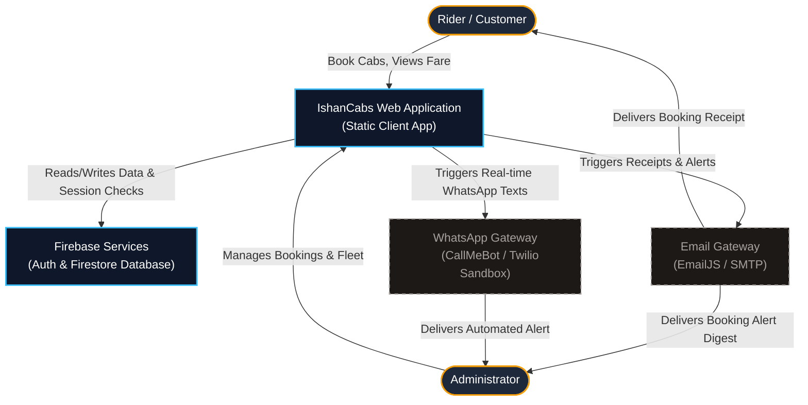
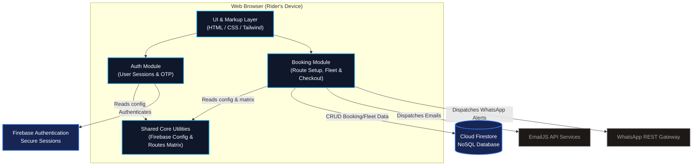
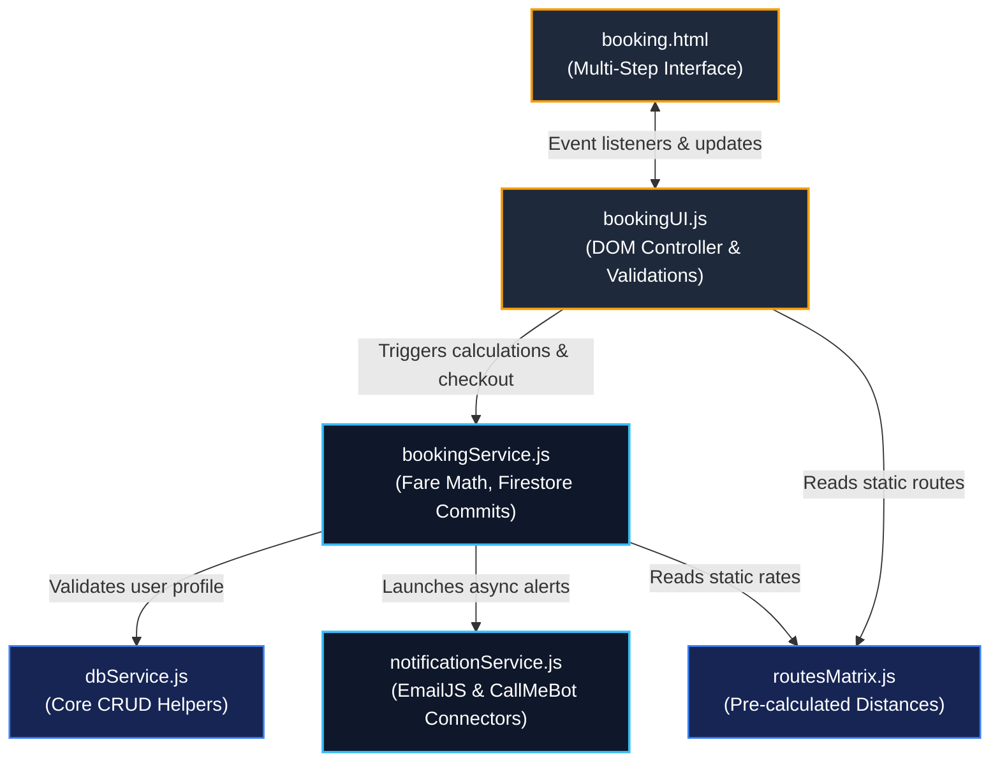
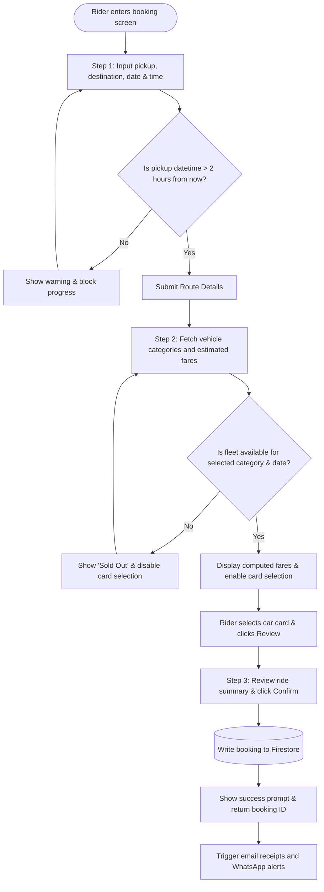
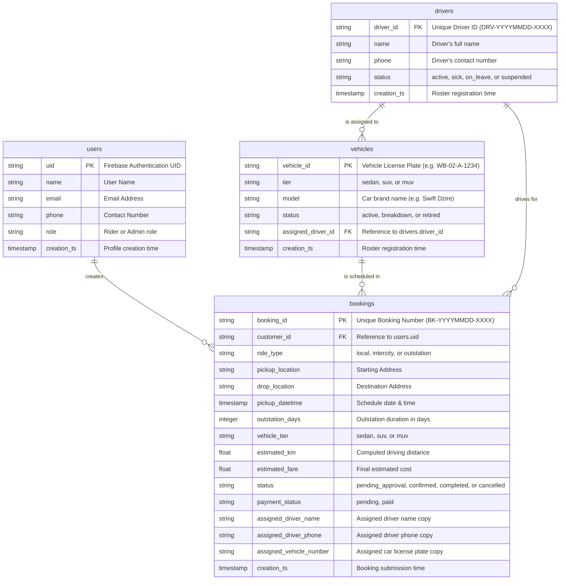

# 🚖 IshanCabs: High-Level Application Design & Architecture Document

This document outlines the high-level system architecture, database design, and component interactions of the **IshanCabs Web Application**. It serves as an architectural blueprint for developers, stakeholders, and clients.

---

## 1. 🌐 High-Level Architecture Overview

IshanCabs is built as a **Serverless, Client-First Web Application**. Instead of utilizing a custom-built backend server (like Node.js/Express or Python/Django), the application runs directly inside the customer's web browser and communicates securely with cloud-based services.

### Core Architecture Pillars:
1. **Frontend (Browser Environment)**: Renders the user interface. Built with HTML5, CSS3, Tailwind CSS (for modern layouts), and standard ES Modules (JavaScript) for modular code structure.
2. **Database & Auth (Cloud Infrastructure)**: Uses **Firebase Authentication** for secure sign-in (OTP and Google OAuth) and **Cloud Firestore** as a real-time, NoSQL document database.
3. **External Services (Notification Gateways)**: Uses third-party REST APIs (like EmailJS and CallMeBot/Twilio) to trigger automated transactional emails and WhatsApp alerts.

---

## 2. 📊 C4 Architecture Diagrams

The C4 model helps visualize system boundaries, containers, and code components in progressive levels of detail.

### C4 Level 1: System Context Diagram
This diagram shows the system boundaries and how different actors (Rider, Admin) interact with the IshanCabs platform and external services.

---

### C4 Level 2: Container Diagram
This diagram drills down into the core containers that run inside the browser and how they connect to the database and external integrations.

---

### C4 Level 3: Component Diagram for Booking/Notification Container
This diagram illustrates the code structure inside the **Booking Module** and how modules import each other to calculate fares and process checkouts.

---

## 3. 🔄 System Process Flowcharts

### Customer Booking Lifecycle (Multi-Step Wizard)
This flowchart shows how a user moves through the multi-step booking process, enforcing lead times and verifying fleet availability.

---

## 4. 🗄️ Database Entity Relationship Diagram (ERD)

This physical model shows the Firestore collection schemas and how documents link to each other. Because Firestore is NoSQL, relations are maintained by storing reference IDs (Foreign Keys) in the documents.

---

## 5. 📖 High-Level Component Explanations

Here is a straightforward explanation of each file in the codebase and what it is responsible for.

### 🏠 Landing Page & Entry
* **[index.html](file:///Users/ishanmukherjee/AI_Learning/Cab-Website-Build/cab-website/index.html)**: The main entry point of the website. Renders the interactive homepage, showcasing the service tiers, promotional cards, and primary CTA buttons.
* **[app.js](file:///Users/ishanmukherjee/AI_Learning/Cab-Website-Build/cab-website/app.js)**: Configures global layouts, checks current session states, and coordinates links between the homepage and sub-modules.
* **[styles.css](file:///Users/ishanmukherjee/AI_Learning/Cab-Website-Build/cab-website/styles.css)**: The primary visual design system. Outlines typography, custom animations, transitions, and dark background palettes.

### 🔐 Authentication Module (`modules/auth/`)
* **`auth.html`**: A modern interface allowing riders to log in using Google Single Sign-On or standard OTP verification.
* **`authService.js`**: Connects directly with the Firebase Auth API to trigger OTP requests, verify user codes, or resolve Google profile metadata.
* **`authUI.js`**: Listens to user inputs in `auth.html`, validates character inputs, displays error banners, and manages screen redirects on successful sign-in.

### 🚖 Booking Module (`modules/booking/`)
* **`booking.html`**: The multi-step booking panel (Route Setup -> Vehicle Class -> Dispatch Review) designed with a glassmorphic styling system.
* **`bookingUI.js`**: Binds actions to inputs. Manages the visual transition between steps, updates badges (such as showing estimated kilometers), configures date constraints, and displays alerts if fields are missed.
* **`bookingService.js`**: The core operational engine. It queries active fleet occupancy on selected dates to check availability, runs the per-kilometer fare calculations, fetches mock driver/car data, and commits completed bookings to Cloud Firestore.
* **`booking.css`**: Contains styling specifics for step-dot progress indicators, car cards, and animated sold-out overlays.

### ✉️ Notification Module (`modules/booking/notificationService.js`)
* **`notificationService.js`**: The outbound notification engine. Compiles booking receipt attributes, formats styled HTML structures, and dispatches API requests to EmailJS (sending copy receipts to both Rider and Admin) and CallMeBot/Twilio (sending real-time text alerts to the fleet controller's device).

### 🛠️ Shared Core Module (`modules/shared/`)
* **`firebase.js`**: Initializes the global Firebase connection using project configuration keys.
* **`dbService.js`**: Housekeeping CRUD database routines (such as fetching user profile data).
* **`routesMatrix.js`**: A centralized data list containing static distance mappings and fixed/flat route fares between key local terminals (such as Airport and Railway Station).
* **`utils.js`**: Global helper functions used throughout the application (such as formatting currencies to Indian Rupees or toggling visibility classes).
