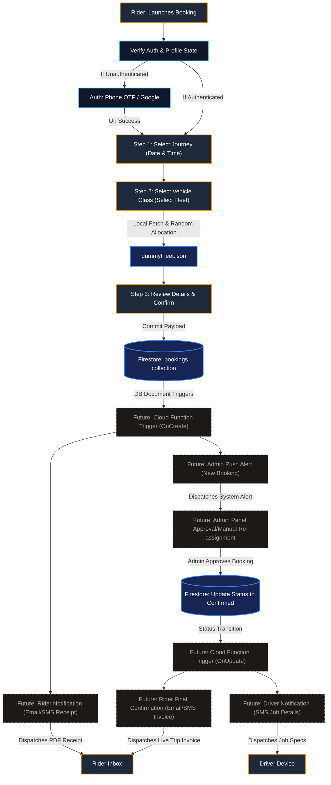

# 🚖 IshanCabs: Booking & Notifications Data Flow Diagram (DFD)

This document visualizes the data flow architectures of the customer booking lifecycle, the dummy fleet selector, and the planned future notification pipelines (Email, SMS, and Admin alert triggers).

---

## 📊 Visual DFD: Process Pipeline Flowchart

This interactive DFD is structured using Mermaid flowchart syntax. It details the existing customer booking database transaction flow alongside the proposed status-driven automated notification subsystems.

---

## 🔍 Detailed Data Flow Description

### 1. Booking Phase (Active Implementation)
1. **Auth & Profile Check**: When the rider opens `/modules/booking/booking.html`, the session state is validated. If the rider lacks a profile, they are redirected to `/modules/auth/auth.html`.
2. **Journey Setup**: Rider selects locations, pickup date, and pickup time (30-minute interval select dropdown). The system restricts inputs to require at least **2 hours scheduling lead time**.
3. **Fleet Selection**: The system fetches flat metrics or calculates round-trip outstation costs and checks vehicles availability. The system does a standard `fetch()` load of `/modules/booking/dummyFleet.json`, extracts the mapped array for the selected tier, and selects a driver/vehicle randomly.
4. **Local Database Commit**: When clicking **Confirm & Book**, the payload is committed directly to Cloud Firestore under `/bookings/{booking_id}` with `status: "pending_approval"`, and an on-screen success prompt is displayed.

---

### 2. Notifications Phase (Planned Enhancements)
1. **Background Cloud Trigger**: Committing a new booking to Firestore fires an `onCreate` trigger inside a Firebase Cloud Function.
2. **Instant Customer Receipt**: The Cloud Function processes the customer's profile details and dispatches a clean transactional email (via SendGrid/Mailgun) or SMS (via Twilio) containing the structured booking breakdown and a PDF receipt.
3. **Instant Admin Dispatch Alert**: The Cloud Function sends a real-time push alert or SMS notification to the administrator panel, warning the fleet controller that a new ride request (`pending_approval`) has arrived.

---

### 3. Verification & Driver Dispatch Phase (Planned Enhancements)
1. **Admin Approval Actions**: The administrator reviews all active pending bookings on the central control panel. The admin can verify details, change the auto-assigned mock driver to a manual choice, and hit **Approve**.
2. **Database Status Update**: Approving the ride updates the document status inside the Firestore bookings collection to `status: "confirmed"`.
3. **Update Trigger Execution**: The database status transition fires an `onUpdate` trigger inside Firebase Cloud Functions.
4. **Automated Driver Dispatch**: The trigger compiles trip details and dispatches a direct SMS to the assigned driver's registered phone, containing coordinates and pickup schedules.
5. **Rider Confirmation Alert**: Concurrently, the trigger dispatches a confirmation email and SMS to the customer, indicating that their ride has been successfully approved, showing their final live driver name, phone number, and vehicle registration license plate.
