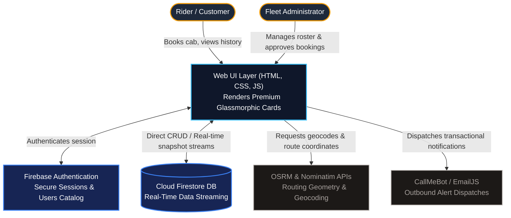
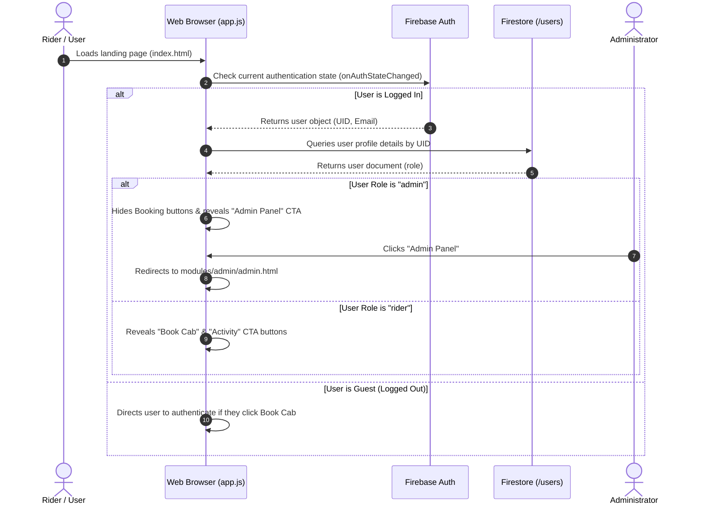
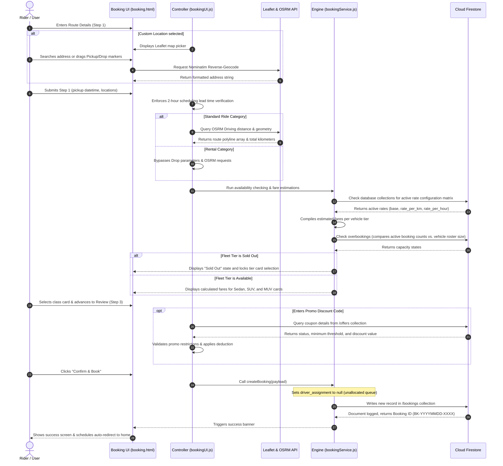
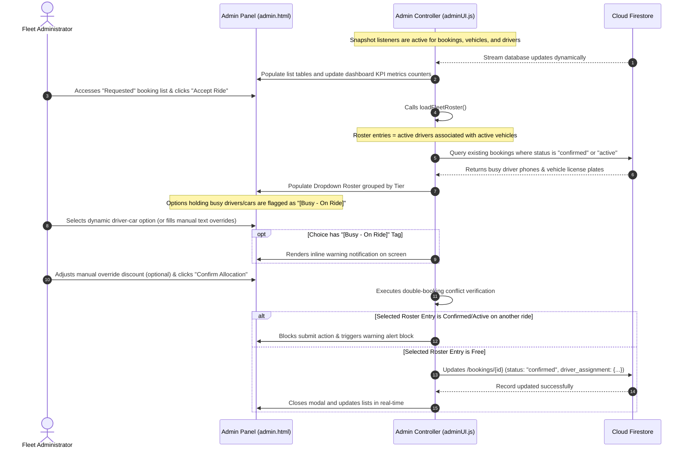
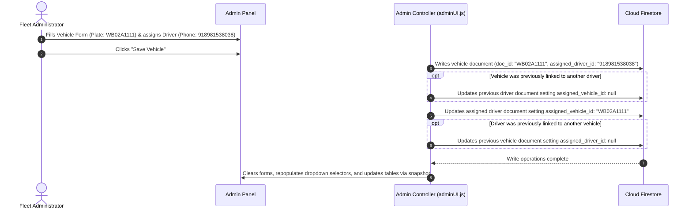
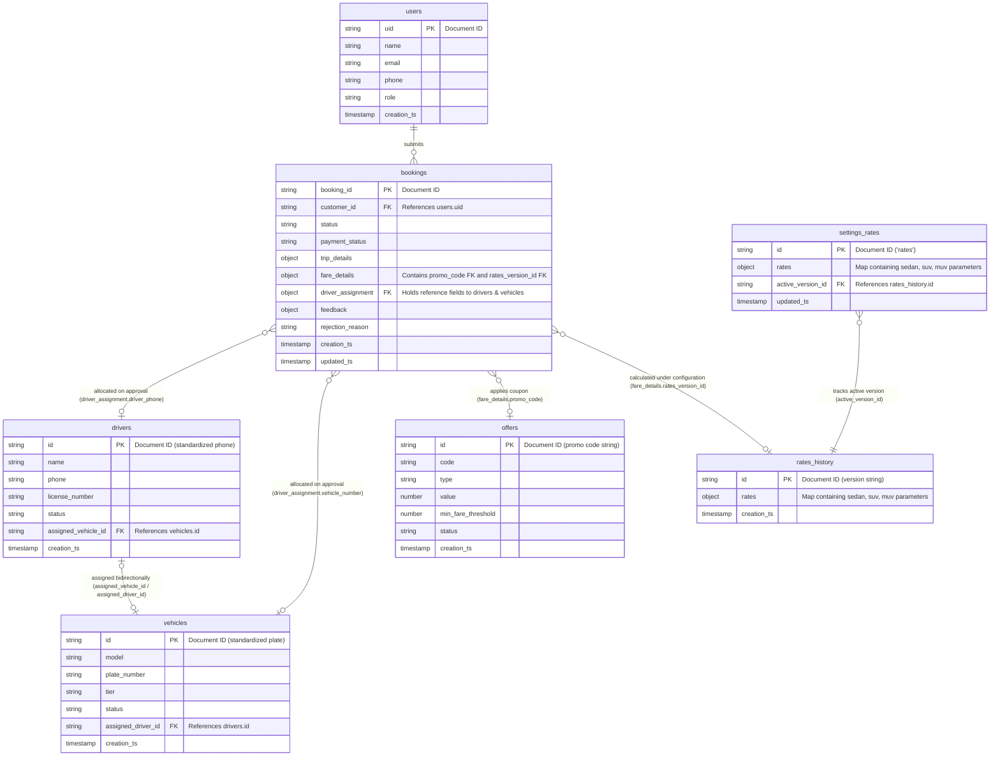

# 🚖 IshanCabs: End-to-End (E2E) Architecture Document

This document provides a comprehensive end-to-end technical overview of the **IshanCabs Web Application** architecture. It describes the client-first serverless structure, outlines user interaction sequence flows for different modules, documents database schemas, and models document relationships.

---

## 1. 🌐 High-Level System Architecture

IshanCabs is built on a **Serverless, Client-First Architecture**. The application does not require a custom backend application server; instead, the browser executes the core application logic and establishes secure, direct connections to cloud services and third-party APIs.

---

## 2. 🔄 Module Interaction Flows (Stick / Sequence Diagrams)

These sequence diagrams depict step-by-step system interactions across different modules.

### A. Rider Authentication & Session Initialization
This flow manages secure access checks during client load, separating standard riders from dashboard administrators.

---

### B. Customer Booking & Custom Location Map Flow
This flow represents the 3-step customer checkout loop. It coordinates Leaflet mapping, Nominatim searching, OSRM route calculations, overbooking checks, promo verification, and database logging.

---

### C. Admin Ride Approval & Roster Allocation
This sequence details how administrators assign available drivers/vehicles to requested rides, checking for scheduling conflicts in real-time.

---

### D. Driver & Vehicle Registry Association Flow
This details the bidirectional reference mapping mechanism when updating or registering operators.

---

## 3. 🗄️ Database Schemas (Cloud Firestore Collections)

Firestore collections are structured as NoSQL JSON documents. Relationships between collections are maintained by storing reference IDs as strings.

### 1. Users Collection (`/users/{uid}`)
Contains customer profile details and roles used for authentication boundaries.
*   **Document ID**: Firebase Auth User UID.

| Field Key | Data Type | Description |
| :--- | :--- | :--- |
| `uid` | `string` | Unique identifier generated by Firebase Auth. |
| `name` | `string` | User's full name. |
| `email` | `string` | User's email address. |
| `phone` | `string` | Contact phone number. |
| `role` | `string` | User permission role (`"rider"` or `"admin"`). |
| `creation_ts` | `Timestamp` | Record creation date and time. |

---

### 2. Bookings Collection (`/bookings/{booking_id}`)
Stores transactional ride requests, parameters, fare details, and driver/car allocations.
*   **Document ID**: Readable date-based unique string (e.g. `BK-20260604-9844`).

| Field Key | Data Type | Description |
| :--- | :--- | :--- |
| `booking_id` | `string` | Unique booking identification number. |
| `customer_id` | `string` | Reference ID matching `/users.uid`. |
| `customer_name` | `string` | User name snapshot copy for fast rendering. |
| `customer_phone` | `string` | User phone snapshot copy. |
| `status` | `string` | State lifecycle: `"pending_approval"`, `"confirmed"`, `"active"`, `"completed"`, `"rejected"`, `"cancelled"`. |
| `payment_status` | `string` | Ledger status: `"pending"`, `"paid"`. |
| `creation_ts` | `Timestamp` | Booking checkout timestamp. |
| `updated_ts` | `Timestamp` | Last modification timestamp. |
| `trip_details` | `Map (Object)` | Holds trip parameters (detailed below). |
| `fare_details` | `Map (Object)` | Holds fare estimations and discounts (detailed below). |
| `driver_assignment` | `Map` or `null` | Allocated driver and vehicle details (detailed below). |
| `feedback` | `Map` or `null` | Rider star rating and comments (detailed below). |
| `rejection_reason` | `string` or `null` | Logged explanation when status is `"rejected"`. |

#### `trip_details` Map Structure:
*   `ride_type`: `string` (`"local"`, `"outstation"`, `"rental"`).
*   `pickup_location`: `string` (Address title).
*   `drop_location`: `string` or `null` (Destination address title).
*   `pickup_date`: `string` (`YYYY-MM-DD`).
*   `pickup_time`: `string` (`HH:MM` in 24-hr format).
*   `outstation_days`: `number` or `null` (Duration for outstation category).
*   `rental_hours`: `number` or `null` (Duration for hourly rentals).
*   `pickup_coords`: `Array [lat, lng]` (Coordinates).
*   `drop_coords`: `Array [lat, lng]` or `null` (Coordinates).
*   `route_polyline`: `string` or `null` (JSON stringified array of coordinates).

#### `fare_details` Map Structure:
*   `vehicle_tier`: `string` (`"sedan"`, `"suv"`, `"muv"`).
*   `estimated_km`: `number` (Driving distance).
*   `base_fare`: `number` (Initial fare configuration mapping).
*   `discount_amount`: `number` (Discount amount applied).
*   `promo_code`: `string` or `null` (Coupon code code). Foreign Key referencing `/offers.id`.
*   `estimated_fare`: `number` (Grand total amount: `base_fare - discount_amount`).
*   `rates_version_id`: `string` or `null` (Foreign Key referencing `/rates_history.id`).

#### `driver_assignment` Map Structure (or `null`):
*   `driver_name`: `string` (Allocated operator name).
*   `driver_phone`: `string` (Allocated operator phone).
*   `vehicle_number`: `string` (Allocated vehicle plate number).

#### `feedback` Map Structure (or `null`):
*   `rating`: `number` (Integer range: 1 to 5).
*   `comments`: `string` (Feedback review comments).

---

### 3. Vehicles Collection (`/vehicles/{vehicle_id}`)
Maintains the operator fleet inventory.
*   **Document ID**: Standardized uppercase alphanumeric plate number (e.g. `WB02A1111` for "WB-02-A-1234").

| Field Key | Data Type | Description |
| :--- | :--- | :--- |
| `model` | `string` | Vehicle model name (e.g., `"Maruti Swift Dzire"`, `"Toyota Innova"`). |
| `plate_number` | `string` | Display license plate string with formatted dashes. |
| `tier` | `string` | Pricing category classification (`"sedan"`, `"suv"`, `"muv"`). |
| `status` | `string` | Maintenance state (`"active"`, `"maintenance"`, `"inactive"`). |
| `assigned_driver_id` | `string` or `null` | Reference ID matching `/drivers.id` (stripped phone). |
| `creation_ts` | `Timestamp` | Roster log timestamp. |

---

### 4. Drivers Collection (`/drivers/{driver_id}`)
Holds the operator drivers registry.
*   **Document ID**: Standardized stripped digits-only phone number (e.g. `918981538038`).

| Field Key | Data Type | Description |
| :--- | :--- | :--- |
| `name` | `string` | Driver operator's full name. |
| `phone` | `string` | Format contact number string (e.g., `"+918981538038"`). |
| `license_number` | `string` | Driver's commercial licensing ID. |
| `status` | `string` | Availability state (`"active"`, `"sick"`, `"on_leave"`, `"inactive"`). |
| `assigned_vehicle_id` | `string` or `null` | Reference ID matching `/vehicles.id` (stripped plate). |
| `creation_ts` | `Timestamp` | Registration log timestamp. |

---

### 5. Offers Collection (`/offers/{code}`)
Coupon codes list compiled for customer deductions.
*   **Document ID**: Upper-case promo code title string (e.g., `SAVE200`).

| Field Key | Data Type | Description |
| :--- | :--- | :--- |
| `code` | `string` | Coupon display code. |
| `type` | `string` | Deduction strategy (`"flat"` value or `"percentage"` ratio). |
| `value` | `number` | Numeric deduction rate (e.g. `200` for flat or `15` for 15%). |
| `min_fare_threshold`| `number` | Minimum booking grand total base required to qualify. |
| `status` | `string` | State parameters (`"active"` or `"inactive"`). |
| `creation_ts` | `Timestamp` | Promotion creation timestamp. |

---

### 6. Settings Collection (`/settings/rates`)
Global configurations used for dynamic system values.
*   **Document ID**: `rates` (Holds nested configurations).

| Field Key | Data Type | Structure Map Description |
| :--- | :--- | :--- |
| `rates` | `Map (Object)` | Holds nested pricing matrices for vehicle tiers: `sedan`, `suv`, and `muv`. |
| `active_version_id`| `string` | Foreign Key referencing `/rates_history.id`. |
| `updated_ts` | `Timestamp` | Setting update timestamp. |

#### Nested Tier Rate Map Structure:
*   `base_cost`: `number` (Base booking minimum charge).
*   `rate_per_km`: `number` (Distance per-kilometer multiplier).
*   `rate_per_hour`: `number` (Hourly duration multiplier for rentals).
*   `driver_allowance_per_day`: `number` (Outstation operator daily halt allowance).

---

### 7. Rates History Collection (`/rates_history/{version_id}`)
Audit log of all historical rate configurations. Enables historical booking calculations to be audited back to the active rates configuration used during checkout.
*   **Document ID**: `R-` followed by creation timestamp (e.g. `R-1717540200000`).

| Field Key | Data Type | Description |
| :--- | :--- | :--- |
| `rates` | `Map (Object)` | Pricing matrices for vehicle tiers (same structure as above). |
| `creation_ts` | `Timestamp` | Version registration timestamp. |

---

## 4. 📊 Entity Relationship Diagram (ERD)

This diagram visualizes relationships between the Firestore document collections. Relationships are maintained logically using string references representing keys.

