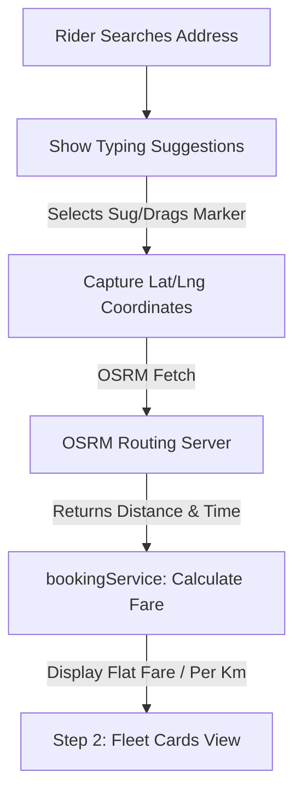

# 🗺️ Dynamic Map-Based Location Selection: Technical Blueprint & Complexity Analysis

This document analyzes the complexity and details the technical implementation plan to transition from static, pre-calculated pickup and drop dropdown locations to a dynamic, interactive map-based selector.

---

## 📊 Complexity Assessment: Medium Complexity

Integrating an interactive map is a **Medium Complexity** task. It requires transitioning from a static system to an asynchronous, API-driven routing system.

### Key Dimensions of Complexity:
1. **Financial/Cost Complexity (Zero Cost)**: 
   * Integrating proprietary systems like Google Maps is expensive (~$17/1k autocomplete queries).
   * **Our Solution**: We propose a **100% free, open-source stack** using **Leaflet.js**, **OpenStreetMap**, and the public **OSRM (Open Source Routing Machine)**. This requires **₹0 / $0 in API costs** and zero setup of billing/billing credits, remaining fully Spark-Tier compliant.
2. **UI/UX Transition (Medium)**:
   * Replaces static `<select>` elements with text search inputs equipped with dynamic autocompletion dropdowns.
   * Embeds an interactive, collapsible dark-themed map container. Users can drag Markers (Orange for Pickup, Blue for Drop) to select coordinates instantly.
3. **Fare Computation Adaptations (Low)**:
   * Moves from reading static distances from `routesMatrix.js` to making a direct asynchronous routing API fetch:
     `https://router.project-osrm.org/route/v1/driving/{pickup_lng},{pickup_lat};{drop_lng},{drop_lat}`
   * The API returns the exact driving distance in meters, which we convert to kilometers (km) and feed directly into our existing `bookingService.calculateFare()` cost matrix.

---

## 🛠️ Proposed Technology Stack (100% Free & Open-Source)

We will equip the landing page with these standard, highly compatible browser CDNs:
* **Map Engine**: [Leaflet.js](https://leafletjs.com/) (Lightweight, mobile-friendly interactive mapping library).
* **Map Tiles**: [CartoDB Dark Matter Tiles](https://cartodb.org/) (Dark-themed maps matching the dark-glassmorphic UI).
* **Location Autocompletion**: [Leaflet Geosearch](https://github.com/smeijer/leaflet-geosearch) or direct Nominatim OSM fetches (providing typing suggestions as you search for addresses in Kolkata, Howrah, or outer West Bengal).
* **Directions & Distance Calculation**: [OSRM API](https://project-osrm.org/) (Computes the exact driving distance and time dynamically).

---

## 🔄 Proposed Changes



### 1. Booking Panel UI Updates
#### [MODIFY] [booking.html](file:///Users/ishanmukherjee/AI_Learning/Cab-Website-Build/cab-website/modules/booking/booking.html)
* Replace the select tags `pickup-select` and `drop-select` with text search inputs:
  ```html
  <input type="text" id="pickup-address" placeholder="Search Pickup Address..." required class="...">
  <input type="text" id="drop-address" placeholder="Search Destination..." required class="...">
  ```
* Inject a dedicated, beautiful collapsible map canvas container under the input fields:
  ```html
  <div id="booking-map" class="h-64 rounded-2xl border border-slate-800 hidden transition-all duration-500 overflow-hidden"></div>
  ```

### 2. Stylesheet Upgrades
#### [MODIFY] [booking.css](file:///Users/ishanmukherjee/AI_Learning/Cab-Website-Build/cab-website/modules/booking/booking.css)
* Add Leaflet styling overlays and override Leaflet core popups/markers to match the dark warm-gold theme.

### 3. JavaScript Logic Integration
#### [MODIFY] [bookingUI.js](file:///Users/ishanmukherjee/AI_Learning/Cab-Website-Build/cab-website/modules/booking/bookingUI.js)
* Initialize Leaflet map centered in Kolkata (`[22.5726, 88.3639]`).
* Bind address autocomplete to the address inputs.
* Add two draggable markers:
  * **Pickup Marker**: Orange marker, default position near Airport/Station.
  * **Drop Marker**: Blue marker.
* Tapping/dragging updates coordinates and initiates Nominatim reverse-geocoding to display the human-readable address in the inputs.
* On submission, fetch driving distance from OSRM:
  ```javascript
  const url = `https://router.project-osrm.org/route/v1/driving/${pickupLng},${pickupLat};${dropLng},${dropLat}?overview=false`;
  const response = await fetch(url);
  const data = await response.json();
  const distanceKm = data.routes[0].distance / 1000;
  ```

#### [MODIFY] [bookingService.js](file:///Users/ishanmukherjee/AI_Learning/Cab-Website-Build/cab-website/modules/booking/bookingService.js)
* Keep `routesMatrix.js` as a fallback system.
* Adapt `calculateFare` to compute costs directly from calculated driving distance for *all* dynamic point-to-point routes, while preserving fixed/flat fares if geocodes fall inside station/airport zones.

---

## ❓ Open Questions for User Review

Please review the following decisions, which will shape the implementation details:

> [!IMPORTANT]
> **Question 1: Geofencing Boundary Limits**
> Currently, IshanCabs operates in **Kolkata & Howrah**. When using map-based selection, should we restrict riders from picking starting points outside of the Kolkata-Howrah metropolitan area, or allow them to pick any pickup address in West Bengal?
> * *(Recommendation: Restrict search results and geocodes to West Bengal and warn if pickup coordinate is outside Kolkata/Howrah boundaries.)*

> [!IMPORTANT]
> **Question 2: Map Visibility Preference**
> How should the map display?
> * **Option A (Collapsible)**: Hidden by default, expanding dynamically when the rider clicks a "Choose on Map" button. (Saves screen real estate).
> * **Option B (Always Open)**: Embedded permanently under the address inputs, rendering a large, engaging modern map view instantly.

---

## 🔍 Verification Plan

### Automated/Code Verifications:
* Validate that Leaflet scripts and stylesheets load correctly from secure open CDNs.
* Assert that geosearch Nominatim queries return accurate West Bengal coordinates.
* Verify OSRM dynamic routes resolve successfully, returning distances inside realistic limits (checking against known offline control pairings).

### Manual Verifications:
* Emulate different devices to confirm that the Leaflet map adjusts responsively.
* Drag markers across Kolkata districts and verify that estimated kilometers and computed Sedan/SUV fares update accurately inside the panel.
